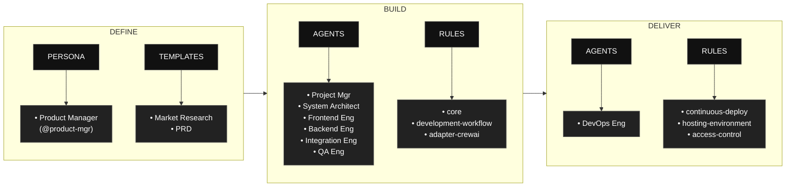

# BAGANA AI – Content Strategy Platform

**BAGANA AI** is an AI-powered platform for KOL, influencer, and content creator agencies to manage content strategy at scale. It combines **content planning**, **sentiment analysis**, and **market trend insights** so agencies can create structured multi-talent content plans, optimize messaging and engagement, and run data-driven campaigns without proportionally increasing manual workload.

**Repository:** [github.com/louistherhansen/bagana-ai-conent-planer](https://github.com/louistherhansen/bagana-ai-conent-planer)

This project is built using the **AAMAD** (AI-Assisted Multi-Agent Application Development) framework for context-driven, multi-agent development with CrewAI.

---

## Table of Contents

- [About BAGANA AI](#about-bagana-ai)
- [AAMAD phases at a glance](#aamad-phases-at-a-glance)
- [Repository Structure](#repository-structure)
- [Getting Started](#getting-started)
- [Phase 1: Define Workflow (Product Manager)](#phase-1-define-workflow-product-manager)
- [Phase 2: Build Workflow (Multi-Agent)](#phase-2-build-workflow-multi-agent)
- [Core Concepts](#core-concepts)
- [Contributing](#contributing)
- [License](#license)

---

## About BAGANA AI

BAGANA AI targets agency ops managers, content strategists, and campaign managers who coordinate multiple talents and campaigns. It provides:

- **Structured multi-talent content plans** — Calendars, briefs, and messaging aligned to campaigns
- **Sentiment analysis** — Tone and sentiment inputs for content and briefs
- **Market trend insights** — Trend and market data to inform strategy
- **Unified workflow** — One platform for planning, sentiment, and trends (no manual copy-paste across tools)

Key artifacts: [Market Research (MRD)](project-context/1.define/mrd.md), [Product Requirements (PRD)](project-context/1.define/prd.md), and the [use case](Usecase.txt).

---

## AAMAD phases at a glance

AAMAD organizes work into three phases: Define, Build, and Deliver, each with clear artifacts, personas, and rules to keep development auditable and reusable. 
The flow begins by defining context and templates, proceeds through multi‑agent build execution, and finishes with operational delivery.



- Phase 1: (Define)
    - Product Manager persona (`@product-mgr`) conducts prompt-driven discovery and context setup, supported by templates for Market Research Document (MRD) and Product Requirements Document (PRD), to standardize project scoping.

- Phase 2: (Build)
    - Multi‑agent execution by Project Manager, System Architect, Frontend Engineer, Backend Engineer, Integration Engineer, and QA Engineer, governed by core, development‑workflow, and CrewAI‑specific rules.

- Phase 3: (Deliver)
    - DevOps Engineer focuses on release and runtime concerns using rules for continuous deployment, hosting environment definitions, and access control.


---

## Repository Structure

    bagana-ai-conent-planer/
    ├─ .cursor/
    │   ├─ agents/    # Agent persona definitions (project-mgr, system-arch, frontend, backend, etc.)
    │   ├─ prompts/   # Phase-specific agent prompts
    │   ├─ rules/     # AAMAD core, workflow, adapter (CrewAI), epics
    │   └─ templates/ # MRD, PRD, SAD generation templates
    ├─ project-context/
    │   ├─ 1.define/  # MRD, PRD, SAD (mrd.md, prd.md, sad.md)
    │   ├─ 2.build/   # Setup, frontend, backend, integration, QA artifacts
    │   └─ 3.deliver/ # QA logs, deploy configs, release notes
    ├─ Usecase.txt    # BAGANA AI use case (source for PRD)
    ├─ CHECKLIST.md   # Step-by-step execution guide
    └─ README.md      # This file

**Framework artifacts** in `.cursor/` are the AAMAD rules and templates. **project-context/** holds BAGANA AI–specific outputs (MRD, PRD, SAD, build artifacts).

---

## Getting Started

1. **Clone this repository.**
   ```bash
   git clone https://github.com/louistherhansen/bagana-ai-conent-planer.git
   cd bagana-ai-conent-planer
   ```
2. Ensure `.cursor/` contains the full agent, prompt, and rule set (included in repo).
3. Follow [CHECKLIST.md](CHECKLIST.md) to run phases — e.g. *create-mrd*, *create-prd*, *create-sad*, *setup-project* — using Cursor or another agent-enabled IDE.
4. Each persona (e.g. `@project-mgr`, `@system-arch`) runs its epic(s) and writes artifacts under `project-context/`.
5. Review, test, and iterate toward the MVP defined in the PRD.

---

## Phase 1: Define Stage (Product Manager)

The Product Manager persona (`@product-mgr`) conducts prompt-driven discovery and context setup to standardize project scoping:

- **Market Research:** Generate [MRD](project-context/1.define/mrd.md) using `.cursor/templates/mr-template.md` (review use case and PRD).
- **Requirements:** Generate [PRD](project-context/1.define/prd.md) using `.cursor/templates/prd-template.md` (from use case / research).
- **Context Summary:** Create comprehensive context handoff artifacts for technical teams.
- **Validation:** Ensure completeness of market analysis, user personas, feature requirements, and success metrics.

Phase 1 outputs live in `project-context/1.define/` (MRD, PRD, then SAD from System Architect) and form the foundation for Build and Deliver.

---

## Phase 2: Build Stage (Multi-Agent)

Each role is embodied by an agent persona, defined in `.cursor/agents/`.  
Phase 2 is executed by running each epic in sequence after completing Phase 1:

- **Architecture:** Generate solution architecture document (`sad.md`)
- **Setup:** Scaffold environment, install dependencies, and document (`setup.md`)
- **Frontend:** Build UI + placeholders, document (`frontend.md`)
- **Backend:** Implement backend, document (`backend.md`)
- **Integration:** Wire up chat flow, verify, document (`integration.md`)
- **Quality Assurance:** Test end-to-end, log results and limitations (`qa.md`)

Artifacts are versioned and stored in `project-context/2.build` for traceability.

---

## Core Concepts

- **Persona-driven development:** Each workflow is owned and documented by a clear AI agent persona with a single responsibility principle.
- **Context artifacts:** All major actions, decisions, and documentation are stored as markdown artifacts, ensuring explainability and reproducibility.
- **Parallelizable epics:** Big tasks are broken into epics, making development faster and more autonomous while retaining control over quality.
- **Reusability:** Framework reusable for any project—simply drop in your PRD/SAD and let the agents execute.
- **Open, transparent, and community-driven:** All patterns and artifacts are readable, auditable, and extendable.

---

## Contributing

Contributions are welcome.

- Open an [issue](https://github.com/louistherhansen/bagana-ai-conent-planer/issues) for bugs, feature ideas, or improvements.
- Submit pull requests for template updates, agent persona changes, or documentation.
- Keep artifacts under `project-context/` and `.cursor/` consistent with the PRD and AAMAD rules.

---

## License

Licensed under Apache License 2.0.

> Why Apache-2.0
>    Explicit patent grant and patent retaliation protect maintainers and users from patent disputes, which is valuable for AI/ML methods, agent protocols, and orchestration logic.
>    Permissive terms enable proprietary or closed-source usage while requiring attribution and change notices, which encourages integration into enterprise stacks.
>    Compared to MIT/BSD, Apache-2.0 clarifies modification notices and patent rights, reducing legal ambiguity for contributors and adopters.

---

> For detailed step-by-step Phase 2 execution, see [CHECKLIST.md].  
> For advanced reference and prompt engineering, see `.cursor/templates/` and `.cursor/rules/`.

