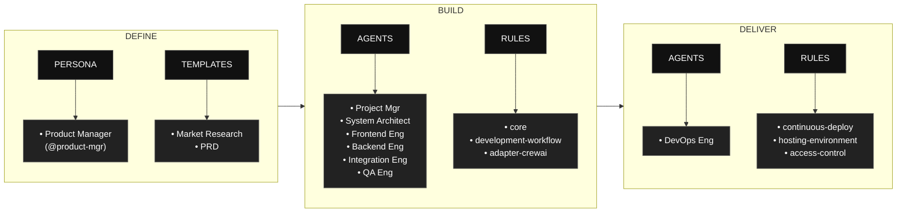

# BAGANA AI – Content Strategy Platform

**BAGANA AI** is an AI-powered platform for KOL, influencer, and content creator agencies to manage content strategy at scale. It combines **content planning**, **sentiment analysis**, and **market trend insights** so agencies can create structured multi-talent content plans, optimize messaging and engagement, and run data-driven campaigns without proportionally increasing manual workload.

**Repository:** [github.com/louistherhansen/bagana-ai-conent-planer](https://github.com/louistherhansen/bagana-ai-conent-planer)

This project is built using the **AAMAD** (AI-Assisted Multi-Agent Application Development) framework for context-driven, multi-agent development with CrewAI.

---

## Table of Contents

- [About BAGANA AI](#about-bagana-ai)
- [AAMAD phases at a glance](#aamad-phases-at-a-glance)
- [Repository Structure](#repository-structure)
- [Getting Started](#getting-started)
- [Phase 1: Define Workflow (Product Manager)](#phase-1-define-workflow-product-manager)
- [Phase 2: Build Workflow (Multi-Agent)](#phase-2-build-workflow-multi-agent)
- [Core Concepts](#core-concepts)
- [Contributing](#contributing)
- [License](#license)
- [Quick reference](#quick-reference)

---

## About BAGANA AI

BAGANA AI targets agency ops managers, content strategists, and campaign managers who coordinate multiple talents and campaigns. It provides:

- **Structured multi-talent content plans** — Calendars, briefs, and messaging aligned to campaigns
- **Sentiment analysis** — Tone and sentiment inputs for content and briefs
- **Market trend insights** — Trend and market data to inform strategy
- **Unified workflow** — One platform for planning, sentiment, and trends (no manual copy-paste across tools)

System design (CrewAI agents, API, data flow, MVP scope) is specified in the [SAD](project-context/1.define/sad.md).

Key artifacts: [use case](Usecase.txt), [MRD](project-context/1.define/mrd.md), [PRD](project-context/1.define/prd.md), [SAD](project-context/1.define/sad.md), [validation](project-context/1.define/validation-completeness.md), [assumptions & open questions](project-context/1.define/assumptions-and-open-questions.md), and [handoff approval](project-context/1.define/handoff-approval.md) for the technical build phase. Build artifacts: [setup](project-context/2.build/setup.md), [frontend](project-context/2.build/frontend.md), [backend](project-context/2.build/backend.md), [integration](project-context/2.build/integration.md), [QA](project-context/2.build/qa.md) (smoke/functional tests, defects, gaps, future work).

---

## AAMAD phases at a glance

AAMAD organizes work into three phases: Define, Build, and Deliver, each with clear artifacts, personas, and rules to keep development auditable and reusable. 
The flow begins by defining context and templates, proceeds through multi‑agent build execution, and finishes with operational delivery.



- Phase 1: (Define)
    - Product Manager persona (`@product-mgr`) conducts prompt-driven discovery and context setup, supported by templates for Market Research Document (MRD) and Product Requirements Document (PRD), to standardize project scoping.

- Phase 2: (Build)
    - Multi‑agent execution by Project Manager, System Architect, Frontend Engineer, Backend Engineer, Integration Engineer, and QA Engineer, governed by core, development‑workflow, and CrewAI‑specific rules.

- Phase 3: (Deliver)
    - DevOps Engineer focuses on release and runtime concerns using rules for continuous deployment, hosting environment definitions, and access control.


---

## Repository Structure

    bagana-ai-conent-planer/
    ├─ .cursor/
    │   ├─ agents/    # Agent persona definitions (project-mgr, system-arch, frontend, backend, etc.)
    │   ├─ prompts/   # Phase-specific agent prompts
    │   ├─ rules/     # AAMAD core, workflow, adapter (CrewAI), epics
    │   └─ templates/ # MRD, PRD, SAD generation templates
    ├─ app/           # Next.js App Router (SAD §3)
    │   ├─ api/crew/  # Chat API; POST invokes CrewAI crew
    │   ├─ chat/      # Chat interface (assistant-ui)
    │   ├─ dashboard/ # Features roadmap
    │   ├─ plans/     # Content plans stub (F1)
    │   ├─ reports/   # Reports stub (F6)
    │   ├─ sentiment/ # Sentiment analysis stub (F2)
    │   ├─ trends/    # Trend insights stub (F3)
    │   └─ settings/  # Settings stub (F10)
    ├─ components/    # React components (PageLayout, ChatInterface, FeatureStub, etc.)
    ├─ config/        # CrewAI agent and task config (SAD §2)
    │   ├─ agents.yaml
    │   ├─ tasks.yaml
    │   └─ stubs.yaml # Backlog agent/task stubs (P1)
    ├─ crew/          # Python CrewAI orchestration layer (SAD §4)
    │   ├─ __init__.py
    │   ├─ run.py     # Entrypoint; kickoff(); --stdin for API
    │   ├─ tools.py   # Stub tools (plan/sentiment/trend validators)
    │   └─ stubs.py   # Backlog stubs (SentimentAPIClient, etc.)
    ├─ project-context/
    │   ├─ 1.define/  # mrd, prd, sad, handoff-approval, assumptions-and-open-questions, validation-completeness
    │   ├─ 2.build/   # setup.md, frontend.md, backend.md, integration.md, qa.md, logs/, artifacts
    │   └─ 3.deliver/ # QA logs, deploy configs, release notes
    ├─ scripts/       # Test and utility scripts
    │   └─ test-chat-roundtrip.mjs  # Basic chat round-trip test (GET + POST /api/crew)
    ├─ .venv/         # Python virtual environment (create via python -m venv .venv; in .gitignore)
    ├─ env.example    # Env template (copy to .env); OPENAI_API_KEY, AAMAD_ADAPTER
    ├─ package.json   # Node deps: Next.js, React, assistant-ui, Tailwind
    ├─ requirements.txt # Python deps: crewai, pyyaml (CrewAI layer)
    ├─ Usecase.txt    # BAGANA AI use case (source for PRD)
    ├─ CHECKLIST.md   # Step-by-step execution guide
    └─ README.md      # This file

**Framework artifacts** in `.cursor/` are the AAMAD rules and templates. **project-context/** holds BAGANA AI–specific outputs (MRD, PRD, SAD, [setup](project-context/2.build/setup.md), [frontend](project-context/2.build/frontend.md), [backend](project-context/2.build/backend.md), [integration](project-context/2.build/integration.md), [QA](project-context/2.build/qa.md)). **app/** and **components/** are the Next.js UI with chat wired to CrewAI; **config/** and **crew/** implement the CrewAI orchestration, agents, and tools.

---

## Getting Started

### Quick start (chat + CrewAI)

1. **Clone this repository.**
   ```bash
   git clone https://github.com/louistherhansen/bagana-ai-conent-planer.git
   cd bagana-ai-conent-planer
   ```

2. **Set environment.** Copy [env.example](env.example) to `.env` and set your OpenAI API key:
   ```bash
   # Windows: copy env.example .env
   # Linux/macOS: cp env.example .env
   # Edit .env and set: OPENAI_API_KEY=sk-your-key-here
   ```
   Do not commit `.env`. Chat and crew runs require a valid `OPENAI_API_KEY`; see [Known issues](project-context/2.build/integration.md#8-known-issues).

3. **Install Node.js dependencies and start the dev server.**
   ```bash
   npm install
   npm run dev
   ```
   Aplikasi berjalan di **http://localhost:3000**. Buka URL tersebut lalu `/chat` untuk asisten AI.

   **Jika muncul peringatan "Port 3000 is in use"** (atau 3001, 3002, …): ada proses dev lain yang masih jalan. Tutup terminal lain yang menjalankan `npm run dev`, atau jalankan sekali saja:
   ```bash
   npm run dev:clean
   ```
   Script ini akan mengosongkan port 3000–3004 lalu menjalankan dev di port 3000.

4. **Install Python (for CrewAI).** The chat API spawns the Python crew. Ensure Python 3.10+ is in PATH:
   ```bash
   # Create venv (optional, recommended)
   python -m venv .venv
   # Windows: .\.venv\Scripts\Activate.ps1
   # Linux/macOS: source .venv/bin/activate

   pip install -r requirements.txt
   ```

### Routes

| Route | Description |
|-------|-------------|
| `/` | Home |
| `/chat` | AI chat — content planning crew (plan → sentiment → trends) |
| `/dashboard` | Feature roadmap |
| `/plans`, `/reports`, `/sentiment`, `/trends`, `/settings` | Stub pages |

### Run crew from CLI

```bash
python -m crew.run "Create a content plan for a summer campaign with 3 talents"
```

Or with JSON on stdin (e.g. for smoke tests):

```bash
# Linux/macOS:
echo '{"message":"Smoke test"}' | python -m crew.run --stdin

# Windows PowerShell:
'{"message":"Smoke test"}' | python -m crew.run --stdin
```

Expect JSON on stdout: `{"status":"complete", "output":"...", "task_outputs": [...]}` or `{"status":"error", "error":"..."}`. With invalid or missing `OPENAI_API_KEY`, the crew returns `status: "error"`.

### Chat API

POST `/api/crew` accepts JSON and returns the crew output:

```bash
curl -X POST http://localhost:3000/api/crew \
  -H "Content-Type: application/json" \
  -d '{"message":"Create a content plan for a summer campaign"}'
```

Response: `{ "status": "complete", "output": "...", "task_outputs": [...] }` or `{ "status": "error", "error": "..." }`. See [backend.md](project-context/2.build/backend.md) §10 for full spec.

### Smoke and functional tests

- **Backend-only (Python crew):** Verifies crew accepts JSON on stdin and returns JSON on stdout. Run from repo root (see “Run crew from CLI” above for stdin examples). With invalid `OPENAI_API_KEY` you get `{"status":"error","error":"..."}`; contract is still valid.
- **Full stack (frontend + backend):** With the dev server running (`npm run dev`), run the round-trip test in another terminal:
  ```bash
  node scripts/test-chat-roundtrip.mjs
  ```
  This checks GET `/api/crew` (health) and POST `/api/crew` (chat). Optional: set `BASE_URL` if the app is not on `http://localhost:3000` (e.g. `BASE_URL=http://localhost:3001 node scripts/test-chat-roundtrip.mjs`).

For verification steps, **known issues** (invalid/missing OPENAI_API_KEY, 120s timeout, no streaming), **defects**, **gaps**, and **future work** (E2E, WCAG, streaming), see [integration.md](project-context/2.build/integration.md) §7–8 and [qa.md](project-context/2.build/qa.md).

### Verifikasi manual setelah build (cek tampilan UI)

Setelah menjalankan `Remove-Item .next; npm run build`:

1. Pastikan tidak ada proses lain yang memakai port 3000 (hentikan `npm run dev` atau `npm start` lain jika ada).
2. Jalankan production server:
   ```powershell
   npm start
   ```
3. Buka **http://localhost:3000** di browser.
4. Cek: Home (header BAGANA AI, nav, hero, tombol Open Chat, grid Key features, footer); Chat (welcome message, input, tombol Send); Dashboard (kartu fitur). Tampilan harus rapi (warna teal BAGANA, layout flex/grid, tidak polos).

Jika tampilan masih berantakan: pastikan `tailwind.config.js` punya **safelist** untuk kelas layout dan BAGANA; `app/globals.css` punya **@layer base** untuk body dan link; lalu hapus `.next` dan jalankan `npm run build` lagi.

**Jika UI tidak berjalan (halaman kosong / tidak tampil):** hapus cache build lalu jalankan ulang dev server:
```powershell
Remove-Item -Recurse -Force .next
npm run dev
```
Lalu buka **http://localhost:3000** (hard refresh: Ctrl+Shift+R).

### AAMAD workflow

5. Ensure `.cursor/` contains the full agent, prompt, and rule set (included in repo).
6. Follow [CHECKLIST.md](CHECKLIST.md) to run phases — e.g. *create-mrd*, *create-prd*, *create-sad*, *setup-project*, *develop-fe*, *develop-be* — using Cursor or another agent-enabled IDE.
7. Each persona (e.g. `@project-mgr`, `@system-arch`, `@frontend.eng`, `@backend.eng`) runs its epic(s) and writes artifacts under `project-context/`.
8. Review, test, and iterate toward the MVP defined in the PRD.

---

## Phase 1: Define Stage (Product Manager)

The Product Manager persona (`@product-mgr`) conducts prompt-driven discovery and context setup to standardize project scoping:

- **Market Research:** Generate [MRD](project-context/1.define/mrd.md) using `.cursor/templates/mr-template.md` (review use case and PRD).
- **Requirements:** Generate [PRD](project-context/1.define/prd.md) using `.cursor/templates/prd-template.md` (from use case / research).
- **Validation:** Validate completeness of market analysis, user personas, feature requirements, success metrics, and business goals ([validation-completeness.md](project-context/1.define/validation-completeness.md)).
- **Assumptions & open questions:** Record in [assumptions-and-open-questions.md](project-context/1.define/assumptions-and-open-questions.md) for downstream resolution (SAD, setup, backend, project plan).
- **Handoff approval:** Approve context boundaries and artifacts for the technical build phase ([handoff-approval.md](project-context/1.define/handoff-approval.md)).

Phase 1 outputs live in `project-context/1.define/`. After approval, the System Architect (`@system-arch`) creates the [SAD](project-context/1.define/sad.md) using *create-sad* (template + PRD/MRD/use case); then Build executes setup, frontend, backend, integration, and QA per [epics-index](.cursor/rules/epics-index.mdc).

---

## Phase 2: Build Stage (Multi-Agent)

Each role is embodied by an agent persona, defined in `.cursor/agents/`.  
Phase 2 starts after [handoff approval](project-context/1.define/handoff-approval.md); run each epic in sequence per [CHECKLIST.md](CHECKLIST.md):

- **Architecture:** System Architect generates [SAD](project-context/1.define/sad.md) (`*create-sad` with PRD, MRD, use case, [sad-template](.cursor/templates/sad-template.md)).
- **Setup:** Project Manager scaffolds environment per PRD/SAD: [setup.md](project-context/2.build/setup.md) documents `config/`, `crew/`, `requirements.txt`, env; Backend implements crew and tools.
- **Frontend:** Next.js + assistant-ui chat, feature stubs, responsive layout; documented in [frontend.md](project-context/2.build/frontend.md)
- **Backend:** Implement backend, document (`backend.md`)
- **Integration:** Wire up chat flow, verify, document (`integration.md`)
- **Quality Assurance:** Test end-to-end, log results and limitations (`qa.md`)

Artifacts are versioned and stored in `project-context/2.build` for traceability.

---

## Core Concepts

- **Persona-driven development:** Each workflow is owned and documented by a clear AI agent persona with a single responsibility principle.
- **Context artifacts:** All major actions, decisions, and documentation are stored as markdown artifacts, ensuring explainability and reproducibility.
- **Parallelizable epics:** Big tasks are broken into epics, making development faster and more autonomous while retaining control over quality.
- **Reusability:** Framework reusable for any project—simply drop in your PRD/SAD and let the agents execute.
- **Open, transparent, and community-driven:** All patterns and artifacts are readable, auditable, and extendable.

---

## Contributing

Contributions are welcome.

- Open an [issue](https://github.com/louistherhansen/bagana-ai-conent-planer/issues) for bugs, feature ideas, or improvements.
- Submit pull requests for template updates, agent persona changes, or documentation.
- Keep artifacts under `project-context/` and `.cursor/` consistent with the PRD and AAMAD rules.

---

## License

Licensed under Apache License 2.0.

> Why Apache-2.0
>    Explicit patent grant and patent retaliation protect maintainers and users from patent disputes, which is valuable for AI/ML methods, agent protocols, and orchestration logic.
>    Permissive terms enable proprietary or closed-source usage while requiring attribution and change notices, which encourages integration into enterprise stacks.
>    Compared to MIT/BSD, Apache-2.0 clarifies modification notices and patent rights, reducing legal ambiguity for contributors and adopters.

---

---

## Quick reference

| Topic | Link |
|-------|------|
| Use case | [Usecase.txt](Usecase.txt) |
| PRD / SAD / MRD | [project-context/1.define/](project-context/1.define/) |
| Setup, frontend, backend, integration, QA | [project-context/2.build/](project-context/2.build/) — [setup](project-context/2.build/setup.md), [frontend](project-context/2.build/frontend.md), [backend](project-context/2.build/backend.md), [integration](project-context/2.build/integration.md), [qa](project-context/2.build/qa.md) |
| Smoke test (Python crew) | `'{"message":"Smoke test"}' \| python -m crew.run --stdin` (PowerShell) or `echo '{"message":"Smoke test"}' \| python -m crew.run --stdin` (bash) |
| Chat round-trip test | `node scripts/test-chat-roundtrip.mjs` (requires `npm run dev` in another terminal) |
| Known issues (API key, timeout, streaming) | [integration.md §8](project-context/2.build/integration.md#8-known-issues) |
| Defects, gaps, future work | [qa.md](project-context/2.build/qa.md) |

---

> **Phase 1:** Validate, record assumptions/open questions, then approve handoff ([handoff-approval.md](project-context/1.define/handoff-approval.md)).  
> **Phase 2:** Step-by-step execution in [CHECKLIST.md](CHECKLIST.md).  
> **Reference:** `.cursor/templates/` and `.cursor/rules/` for prompt engineering and adapter rules.

