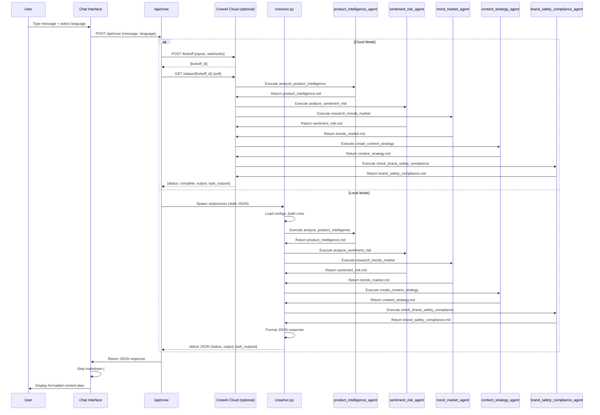

# Content Plan Chat Flow - CrewAI Integration

Flowchart dokumentasi untuk alur Content Plan Chat dari Frontend → Backend → CrewAI → Response.

## Overview

Sistem ini memungkinkan pengguna untuk membuat content plan melalui chat interface yang terhubung dengan CrewAI multi-agent system. Flow mendukung dua mode: **Local (Python subprocess)** dan **Cloud (CrewAI Cloud API)**.

---

## Flowchart Diagram

```mermaid
flowchart TD
    Start([User Types Message<br/>in Chat Interface]) --> LangSelect{Language<br/>Selected?}
    LangSelect -->|Yes| SetLang[Set output_language<br/>from dropdown]
    LangSelect -->|No| DefaultLang[Default: Same as<br/>user message]
    SetLang --> ExtractMsg
    DefaultLang --> ExtractMsg[Extract message text<br/>from ChatRuntimeProvider]
    
    ExtractMsg --> APIReq[POST /api/crew<br/>body: message, language]
    
    APIReq --> CheckCloud{CrewAI Cloud<br/>Config Exists?}
    
    CheckCloud -->|Yes<br/>CREWAI_CLOUD_URL +<br/>CREWAI_BEARER_TOKEN| CloudMode[Cloud Mode:<br/>runCrewCloud]
    CheckCloud -->|No| LocalMode[Local Mode:<br/>runCrew]
    
    %% Cloud Flow
    CloudMode --> CloudKickoff[POST /kickoff<br/>Authorization: Bearer token<br/>body: inputs, webhooks]
    CloudKickoff --> CloudPoll{Poll Status<br/>or Webhook?}
    CloudPoll -->|Poll| PollStatus[GET /status/kickoff_id<br/>Poll every 3s<br/>Max 60 attempts]
    PollStatus --> CloudComplete{Status<br/>Complete?}
    CloudComplete -->|No| PollStatus
    CloudComplete -->|Yes| CloudResult[Extract output<br/>from response]
    CloudPoll -->|Webhook| WebhookWait[Wait for webhook<br/>POST /api/crew/webhook]
    WebhookWait --> CloudResult
    CloudResult --> FormatResponse
    
    %% Local Flow
    LocalMode --> ValidateKey{API Key<br/>Valid?}
    ValidateKey -->|No| KeyError[Return 401 Error<br/>with helpful message]
    ValidateKey -->|Yes| SpawnPy[Spawn Python subprocess<br/>python -m crew.run --stdin]
    
    SpawnPy --> WriteStdin[Write JSON payload<br/>to stdin]
    WriteStdin --> PyLoad[Python: Load .env<br/>Detect API key type]
    
    PyLoad --> DetectKey{Key Type?}
    DetectKey -->|sk-or-v1-...| OpenRouter[Configure OpenRouter<br/>model: openrouter/...]
    DetectKey -->|sk-...| OpenAI[Configure OpenAI<br/>base_url: api.openai.com]
    
    OpenRouter --> LoadConfig
    OpenAI --> LoadConfig[Load YAML Configs<br/>agents.yaml, tasks.yaml]
    
    LoadConfig --> BuildAgents[Build Agents<br/>product_intelligence_agent<br/>sentiment_risk_agent<br/>trend_market_agent<br/>content_strategy_agent<br/>brand_safety_compliance_agent]
    
    BuildAgents --> BindTools[Bind Tools per Agent<br/>product_intelligence_schema_validator<br/>sentiment_schema_validator<br/>trend_schema_validator<br/>plan_schema_validator<br/>brand_safety_schema_validator]
    
    BindTools --> BuildTasks[Build Tasks<br/>analyze_product_intelligence<br/>analyze_sentiment_risk<br/>research_trends_market<br/>create_content_strategy<br/>check_brand_safety_compliance]
    
    BuildTasks --> SetContext[Set Task Context<br/>analyze_product_intelligence: []<br/>analyze_sentiment_risk: [product_intelligence]<br/>research_trends_market: [product_intelligence]<br/>create_content_strategy: [product_intelligence, sentiment_risk, trends_market]<br/>check_brand_safety_compliance: [content_strategy]]
    
    SetContext --> BuildCrew[Create Crew<br/>Sequential execution<br/>verbose=False]
    
    BuildCrew --> Kickoff[crew.kickoff inputs:<br/>user_input, output_language]
    
    Kickoff --> Task1[Task 1: analyze_product_intelligence<br/>Agent: product_intelligence_agent<br/>Output: product_intelligence.md]
    
    Task1 --> Task2[Task 2: analyze_sentiment_risk<br/>Agent: sentiment_risk_agent<br/>Context: product_intelligence output]
    
    Task1 --> Task3[Task 3: research_trends_market<br/>Agent: trend_market_agent<br/>Context: product_intelligence output]
    
    Task2 --> Task4[Task 4: create_content_strategy<br/>Agent: content_strategy_agent<br/>Context: product_intelligence, sentiment_risk, trends_market]
    Task3 --> Task4
    
    Task4 --> Task5[Task 5: check_brand_safety_compliance<br/>Agent: brand_safety_compliance_agent<br/>Context: content_strategy output]
    
    Task5 --> CollectOutputs[Collect Task Outputs<br/>raw_output<br/>task_outputs array]
    
    CollectOutputs --> WriteArtifacts[Write Artifacts<br/>project-context/2.build/artifacts/<br/>product_intelligence.md<br/>sentiment_risk.md<br/>trends_market.md<br/>content_strategy.md<br/>brand_safety_compliance.md]
    
    WriteArtifacts --> StepCallback[Step Callback<br/>Log to trace.log]
    
    StepCallback --> ReturnJSON[Return JSON to stdout<br/>status, output, task_outputs]
    
    ReturnJSON --> ReadStdout[Read stdout from<br/>Python subprocess]
    
    ReadStdout --> ParseJSON{Valid<br/>JSON?}
    ParseJSON -->|No| ParseError[Return Error<br/>with stderr]
    ParseJSON -->|Yes| FormatResponse[Format Response<br/>for API]
    
    FormatResponse --> StripMarkdown[Strip Markdown<br/>Remove # headers<br/>Remove ** bold]
    
    StripMarkdown --> ReturnAPI[Return JSON Response<br/>status, output, task_outputs]
    
    ReturnAPI --> DisplayChat[Display in Chat UI<br/>Show formatted text<br/>Show loading indicator]
    
    DisplayChat --> End([User Sees<br/>Content Plan])
    
    KeyError --> End
    ParseError --> End
    
    style Start fill:#e1f5ff
    style End fill:#d4edda
    style CloudMode fill:#fff3cd
    style LocalMode fill:#d1ecf1
    style Task1 fill:#f8d7da
    style Task2 fill:#f8d7da
    style Task3 fill:#f8d7da
    style Task4 fill:#f8d7da
    style Task5 fill:#f8d7da
    style KeyError fill:#f8d7da
    style ParseError fill:#f8d7da
```

---

## Detailed Flow Steps

### 1. Frontend: User Input

**Component**: `ChatInterface.tsx` → `ChatRuntimeProvider.tsx`

- User types message in chat input
- Optional: User selects output language from dropdown
- `ChatRuntimeProvider` extracts message text and language preference
- Creates `ChatModelAdapter` that calls `/api/crew`

**Key Code**:
```typescript
// ChatRuntimeProvider.tsx
const language = getLanguage();
const body: Record<string, string> = { message };
if (language) body.language = language;

const res = await fetch("/api/crew", {
  method: "POST",
  headers: { "Content-Type": "application/json" },
  body: JSON.stringify(body),
});
```

---

### 2. API Route: Mode Detection

**File**: `app/api/crew/route.ts`

**Decision Point**: Check for CrewAI Cloud configuration

```typescript
const cloudConfig = getCrewCloudConfig();
// Checks: CREWAI_CLOUD_URL + CREWAI_BEARER_TOKEN
```

**Two Paths**:
- **Cloud Mode**: If `CREWAI_CLOUD_URL` and `CREWAI_BEARER_TOKEN` exist
- **Local Mode**: Otherwise, spawn Python subprocess

---

### 3A. Cloud Mode Flow

**Function**: `runCrewCloud()`

1. **Kickoff Request**:
   ```typescript
   POST ${baseUrl}/kickoff
   Headers: Authorization: Bearer ${token}
   Body: {
     inputs: { user_input, output_language, ... },
     taskWebhookUrl?: "...",
     stepWebhookUrl?: "...",
     crewWebhookUrl?: "..."
   }
   ```

2. **Receive kickoff_id** from response

3. **Polling or Webhook**:
   - **Polling**: `GET /status/{kickoff_id}` every 3s, max 60 attempts
   - **Webhook**: Wait for `POST /api/crew/webhook` callback

4. **Extract Result**: Parse output from status response or webhook payload

---

### 3B. Local Mode Flow

**Function**: `runCrew()`

1. **Validate API Key**: Check `OPENROUTER_API_KEY` or `OPENAI_API_KEY` exists

2. **Spawn Python Process**:
   ```typescript
   spawn("python", ["-m", "crew.run", "--stdin"], {
     cwd: projectRoot,
     env: buildCrewEnv(),
     stdio: ["pipe", "pipe", "pipe"]
   })
   ```

3. **Write Payload to stdin**:
   ```json
   {
     "user_input": "...",
     "output_language": "...",
     "campaign_context": "..."
   }
   ```

4. **Read stdout**: Parse JSON response (timeout: 120s)

---

### 4. Python Crew Execution

**File**: `crew/run.py`

#### 4.1 Environment Setup

- Load `.env` file
- Detect API key type:
  - `sk-or-v1-...` → OpenRouter
  - `sk-...` → OpenAI
- Configure `LLM` instance accordingly

#### 4.2 Load Configuration

```python
agents_data = _load_yaml(AGENTS_PATH)  # config/agents.yaml
tasks_data = _load_yaml(TASKS_PATH)    # config/tasks.yaml
```

#### 4.3 Build Agents

From `agents.yaml`:
- `product_intelligence_agent`: Role, goal, backstory, LLM config
- `sentiment_risk_agent`: Role, goal, backstory, LLM config
- `trend_market_agent`: Role, goal, backstory, LLM config
- `content_strategy_agent`: Role, goal, backstory, LLM config
- `brand_safety_compliance_agent`: Role, goal, backstory, LLM config

Bind tools per agent:
- `product_intelligence_agent` → `product_intelligence_schema_validator`
- `sentiment_risk_agent` → `sentiment_schema_validator`
- `trend_market_agent` → `trend_schema_validator`
- `content_strategy_agent` → `plan_schema_validator`
- `brand_safety_compliance_agent` → `brand_safety_schema_validator`

#### 4.4 Build Tasks

From `tasks.yaml`, in dependency order:

1. **analyze_product_intelligence**:
   - Agent: `product_intelligence_agent`
   - Context: `[]` (first task, receives brand input)
   - Output: `project-context/2.build/artifacts/product_intelligence.md`
   - Description includes: `Write the entire output in: {output_language}.`

2. **analyze_sentiment_risk**:
   - Agent: `sentiment_risk_agent`
   - Context: `[analyze_product_intelligence]` (uses product intelligence output)
   - Output: `project-context/2.build/artifacts/sentiment_risk.md`

3. **research_trends_market**:
   - Agent: `trend_market_agent`
   - Context: `[analyze_product_intelligence]` (uses product intelligence output)
   - Output: `project-context/2.build/artifacts/trends_market.md`

4. **create_content_strategy**:
   - Agent: `content_strategy_agent`
   - Context: `[analyze_product_intelligence, analyze_sentiment_risk, research_trends_market]` (synthesizes all prior outputs)
   - Output: `project-context/2.build/artifacts/content_strategy.md`

5. **check_brand_safety_compliance**:
   - Agent: `brand_safety_compliance_agent`
   - Context: `[create_content_strategy]` (reviews content strategy output)
   - Output: `project-context/2.build/artifacts/brand_safety_compliance.md`

#### 4.5 Execute Crew

```python
crew = Crew(
    agents=[...],
    tasks=[
        analyze_product_intelligence,
        analyze_sentiment_risk,
        research_trends_market,
        create_content_strategy,
        check_brand_safety_compliance
    ],
    verbose=False,
    step_callback=_step_callback
)

result = crew.kickoff(inputs={
    "user_input": "...",
    "output_language": "..."
})
```

**Execution Order** (Sequential):
1. `analyze_product_intelligence` executes first (no dependencies)
2. `analyze_sentiment_risk` and `research_trends_market` execute in parallel (both depend on `analyze_product_intelligence`)
3. `create_content_strategy` executes after all three above complete
4. `check_brand_safety_compliance` executes last (depends on `create_content_strategy`)
5. **Human Approval** (Agency Lead / KOL) - handled outside CrewAI as a review gate

#### 4.6 Step Callback

Each step logs to `project-context/2.build/logs/trace.log`:
```
[2026-02-02T10:30:00Z] step: product_intelligence_agent | analyze_product_intelligence
[2026-02-02T10:30:00Z] step: sentiment_risk_agent | analyze_sentiment_risk
[2026-02-02T10:30:00Z] step: trend_market_agent | research_trends_market
[2026-02-02T10:30:00Z] step: content_strategy_agent | create_content_strategy
[2026-02-02T10:30:00Z] step: brand_safety_compliance_agent | check_brand_safety_compliance
```

#### 4.7 Return Result

```python
return {
    "status": "complete",
    "output": raw_output,  # Main output string
    "task_outputs": [      # Array of task outputs
        {"task": "analyze_product_intelligence", "output": "..."},
        {"task": "analyze_sentiment_risk", "output": "..."},
        {"task": "research_trends_market", "output": "..."},
        {"task": "create_content_strategy", "output": "..."},
        {"task": "check_brand_safety_compliance", "output": "..."}
    ]
}
```

Written to stdout as JSON.

---

### 5. API Response Processing

**File**: `app/api/crew/route.ts`

1. Parse JSON from stdout (local) or API response (cloud)
2. Handle errors (401, timeout, parse errors)
3. Return structured response:
   ```json
   {
     "status": "complete" | "error",
     "output": "...",
     "task_outputs": [...],
     "error": "..." // if error
   }
   ```

---

### 6. Frontend: Display Result

**Component**: `ChatRuntimeProvider.tsx` → `ChatInterface.tsx`

1. **Receive Response**: Parse JSON from `/api/crew`

2. **Extract Output**:
   - Primary: `data.output`
   - Fallback: Combine `data.task_outputs` array

3. **Strip Markdown**:
   ```typescript
   function stripMarkdownHeadersAndBold(text: string): string {
     return text
       .replace(/^#+\s*/gm, "")      // Remove # headers
       .replace(/\*\*([^*]*)\*\*/g, "$1");  // Remove ** bold
   }
   ```

4. **Display**: Render text in chat UI via `assistant-ui` components

---

## Key Configuration Files

### `config/agents.yaml`
Defines agent roles, goals, backstories, and LLM configuration.

The system uses five specialized agents in a sequential pipeline:

1. **product_intelligence_agent**
   - **Role**: Product intelligence and brand context analyst
   - **Goal**: Analyze brand input, product information, and campaign context to extract key insights, product features, target audience, and brand positioning
   - **Backstory**: Expert in product marketing and brand strategy. 10+ years analyzing products, brands, and market positioning for content campaigns.
   - **Configuration**: 
     - LLM: OpenAI
     - Max iterations: 12
     - Max execution time: 120 seconds
     - Max retry limit: 2
     - Tools: `product_intelligence_schema_validator` (bound at runtime)
   - **Task**: Analyzes brand input and extracts product intelligence (`product_intelligence.md`)

2. **sentiment_risk_agent**
   - **Role**: Sentiment and risk analyst for content and brand safety
   - **Goal**: Analyze sentiment, tone, and potential risks in content plans; identify brand safety concerns and negative sentiment patterns
   - **Backstory**: Domain expert in brand safety, audience sentiment analysis, and risk mitigation. 8+ years in social listening, tone analysis, and content risk assessment.
   - **Configuration**:
     - LLM: OpenAI
     - Max iterations: 12
     - Max execution time: 90 seconds
     - Max retry limit: 2
     - Tools: `sentiment_schema_validator` (bound at runtime)
   - **Task**: Analyzes sentiment and risks based on product intelligence (`sentiment_risk.md`)

3. **trend_market_agent**
   - **Role**: Market trends and industry insights researcher
   - **Goal**: Research and analyze relevant market trends, industry insights, and creator economy dynamics for content strategy
   - **Backstory**: Research-focused analyst specializing in market trends, creator economy, and content strategy insights. 6+ years in market research, trend analysis, and competitive intelligence.
   - **Configuration**:
     - LLM: OpenAI
     - Max iterations: 12
     - Max execution time: 90 seconds
     - Max retry limit: 2
     - Tools: `trend_schema_validator` (bound at runtime)
   - **Task**: Researches market trends and industry insights (`trends_market.md`)

4. **content_strategy_agent**
   - **Role**: Content strategy and multi-talent plan author
   - **Goal**: Create comprehensive content strategies and multi-talent content plans based on product intelligence, sentiment analysis, and market trends
   - **Backstory**: Experienced content strategist specializing in multi-creator campaigns and content operations. 10+ years in content strategy, multi-talent coordination, and campaign planning.
   - **Configuration**: 
     - LLM: OpenAI
     - Max iterations: 12
     - Max execution time: 120 seconds
     - Max retry limit: 2
     - Tools: `plan_schema_validator` (bound at runtime)
   - **Task**: Creates comprehensive content strategy synthesizing all prior insights (`content_strategy.md`)

5. **brand_safety_compliance_agent**
   - **Role**: Brand safety and compliance auditor
   - **Goal**: Review content strategies for brand safety compliance, regulatory adherence, and alignment with brand guidelines
   - **Backstory**: Compliance and brand safety expert with deep knowledge of content regulations, brand guidelines, and risk mitigation. 8+ years in brand compliance, content moderation, and regulatory adherence.
   - **Configuration**:
     - LLM: OpenAI
     - Max iterations: 12
     - Max execution time: 90 seconds
     - Max retry limit: 2
     - Tools: `brand_safety_schema_validator` (bound at runtime)
   - **Task**: Reviews content strategy for brand safety and compliance (`brand_safety_compliance.md`)

**Execution Flow**: 
1. `product_intelligence_agent` executes first (receives brand input)
2. `sentiment_risk_agent` and `trend_market_agent` execute in parallel (both depend on product intelligence)
3. `content_strategy_agent` executes after all three above complete (synthesizes all insights)
4. `brand_safety_compliance_agent` executes last (reviews content strategy)
5. **Human Approval** (Agency Lead / KOL) - handled outside CrewAI as a review gate

### `config/tasks.yaml`
Defines task descriptions, expected outputs, agent assignments, and context dependencies.

Each task specifies:
- **Agent assignment**: Which agent executes the task
- **Description**: Detailed instructions including user input interpolation and language support
- **Expected output**: Target file path and required markdown headings
- **Context dependencies**: Which prior task outputs are passed as context (via `context_from`)
- **Output file**: Where the artifact is written (`project-context/2.build/artifacts/`)

### `.env`
Required variables:
- `OPENROUTER_API_KEY` or `OPENAI_API_KEY` (for local mode)
- `CREWAI_CLOUD_URL` (optional, for cloud mode)
- `CREWAI_BEARER_TOKEN` (optional, for cloud mode)
- `CREWAI_WEBHOOK_TASK_URL` (optional)
- `CREWAI_WEBHOOK_STEP_URL` (optional)
- `CREWAI_WEBHOOK_CREW_URL` (optional)

---

## Output Artifacts

All artifacts are written to `project-context/2.build/artifacts/`:

1. **product_intelligence.md**: Product intelligence analysis with sections:
   - Product Overview
   - Key Features
   - Target Audience
   - Brand Positioning
   - Campaign Objectives
   - Constraints and Requirements
   - Audit

2. **sentiment_risk.md**: Sentiment and risk analysis with sections:
   - Sentiment Summary
   - Identified Risks
   - Brand Safety Concerns
   - Risk Mitigation Strategies
   - Opportunities
   - Recommendations
   - Audit

3. **trends_market.md**: Market trends and insights with sections:
   - Key Market Trends
   - Creator Economy Insights
   - Competitive Landscape
   - Content Format Trends
   - Timing and Seasonality
   - Implications for Strategy
   - Recommendations
   - Sources
   - Audit

4. **content_strategy.md**: Content strategy plan with sections:
   - Strategic Overview
   - Objectives
   - Talent Assignments
   - Content Themes
   - Content Calendar and Timeline
   - Key Messaging
   - Content Formats
   - Distribution Strategy
   - Audit

5. **brand_safety_compliance.md**: Brand safety and compliance audit with sections:
   - Compliance Summary
   - Brand Safety Assessment
   - Regulatory Compliance Check
   - Brand Guidelines Alignment
   - Flagged Issues
   - Recommendations
   - Approval Status
   - Audit

---

## Error Handling

### API Key Errors
- **401 Unauthorized**: Invalid/expired API key
- **Detection**: Checks key format (`sk-or-v1-...` vs `sk-...`)
- **User Message**: Provides helpful tips with links to create new keys

### Timeout Errors
- **Local Mode**: 120s timeout for Python subprocess
- **Cloud Mode**: 180s timeout (60 polls × 3s)

### Parse Errors
- Invalid JSON from stdout → Returns error with stderr
- Missing required fields → Returns error message

---

## Multi-Language Support

All agents and tasks support multi-language output. The system can generate content in Indonesian, English, or any other language specified by the user.

**How it works:**

1. **Language Selection**: User selects language from dropdown in chat interface (or defaults to the same language as the user's message)
2. **Language Passing**: Language is passed as `output_language` in the API payload to `/api/crew`
3. **Task Instructions**: All task descriptions include explicit instruction: `Write the entire output in {output_language}. All content, headings, descriptions, and analysis must be in the specified language. Do not mix languages.`
4. **Agent Execution**: Each agent receives the `{output_language}` placeholder in their task description and generates all output content in that language
5. **Consistent Output**: All artifacts (product_intelligence.md, sentiment_risk.md, trends_market.md, content_strategy.md, brand_safety_compliance.md) are written entirely in the selected language

**Supported Languages:**
- Indonesian (Bahasa Indonesia)
- English
- Other languages as supported by the underlying LLM model

**Default Behavior:**
- If no language is specified, agents will output in "the same language as the user's message (e.g. Indonesian, English, or other as appropriate)"
- This ensures the output matches the user's input language automatically

---

## Webhook Support (Cloud Mode)

If webhook URLs are configured:
- CrewAI Cloud sends callbacks to `/api/crew/webhook`
- Webhook handler logs events and can update UI in real-time
- Supports: task completion, step updates, crew completion

---

## Sequence Diagram (Alternative View)



---

## Notes

- **Deterministic Execution**: Sequential crew execution ensures reproducible results
- **Context Passing**: Tasks receive prior task outputs via `context_from` in YAML
- **Schema Validation**: Each agent has a schema validator tool for output validation
- **Audit Trail**: All artifacts include Audit sections with timestamp, persona ID, action name
- **Trace Logging**: Step callbacks log to `project-context/2.build/logs/trace.log` for debugging
- **Pipeline Flow**: Brand Input → Product Intelligence → Sentiment & Risk (parallel) → Trend & Market (parallel) → Content Strategy → Brand Safety & Compliance → Human Approval (external gate)

---

**Last Updated**: 2026-02-02  
**Version**: 1.0
